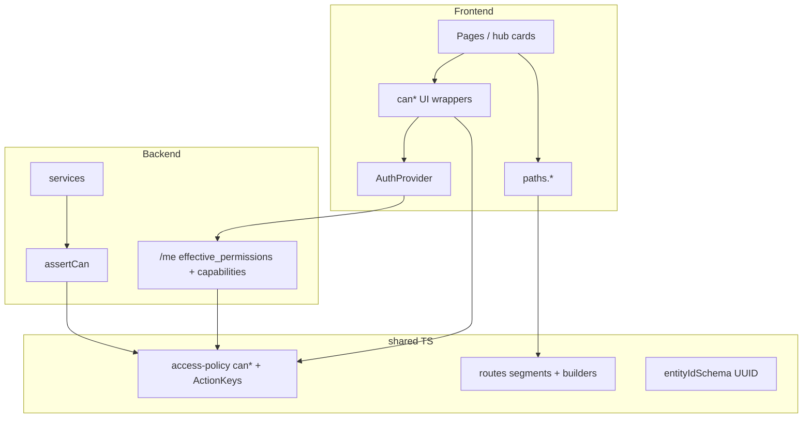

# Platform Hardening — Full Plan (v3 — first-prod ambitious)

> **Canonical strategy doc for this repo.**  
> Implement when you decide (say **impl** / **OK** in chat, or work phase-by-phase yourself).  
> To change the strategy: edit this file or ask in Cursor chat — keep this MD and the approach in sync.  
> **Cursor rules copies (not active until copied):** [`cursor-rules-library/`](cursor-rules-library/README.md)

**Status:** planned — not started  
**Branch when implementing:** `refactor/platform-hardening`

---

## Goal

First production is the right moment to **reshape the codebase**: clean permissions, flexible URLs, UUID ids, AI-friendly modules — so you and assistants can extend the app without forgetting role conditions.

**UI rule:** pages use `can*` / flags (true/false). They do not ask `role === "WALI"`.

**Three permission surfaces (all kept):**

| Surface | Where | Purpose |
|---------|--------|---------|
| **UI `can*`** | `shared/access-policy` + thin FE wrappers | You/AI flip conditions in code; hub cards, buttons, sections |
| **BE `assertCan` / `can*`** | same shared rules + service asserts | Server never trusts UI; same logic, one source |
| **API permissions** | `effective_permissions` + resource flags (`accessLevel`, `can_comment`, …) | Runtime profiles / grants; `/me` + list/detail payloads |

**Content-kind rule (non-negotiable):** rapport behavior is **not the same for all types**. Agents often remove a type-specific condition or apply one rule to every kind. Every `can*` / assert that depends on type must take **`content_kind`** + **`versioning_mode`** (and `commune_content_kind` when liste).

---

## Rapport kinds & versioning (stop AI wiping type conditions)

### Discriminators (always pass into rapport-scoped `can*`)

| Field | Values | Meaning |
|-------|--------|---------|
| `content_kind` | `table_grid` \| `document_compose` \| `fiche_lecture` \| `commune_list` | What the rapport is |
| `versioning_mode` | `versioned` \| `standalone` | Multi-version archive vs single / file-style lifecycle |
| `commune_content_kind` | (when `commune_list`) | Table vs complex per-entity |

### Kind matrix (do not flatten)

| Kind | Typical versioning | Easy-to-break rules (examples) |
|------|--------------------|--------------------------------|
| `table_grid` | often `versioned` | Start new version after accept; version archive; Excel export |
| `document_compose` | `versioned` or `standalone` | Templates; rich HTML; **version UI only if** `versioning_mode=versioned` |
| `fiche_lecture` | **file / new each time** (shared; `owner_office_user_id` null) | **No** table-style “start new version”; Wali response export block **only here**; one fiche type per leaf |
| `commune_list` | versioned or standalone | Bulk vs per-entity; Excel in table mode; entity change highlights |

### Policy shape (required in `shared/access-policy`)

```ts
// Kind context is required — not “if the agent remembers”
canStartNewVersion({ content_kind, versioning_mode, status, ... })
// true only if versioning_mode === 'versioned' AND kind allows it (never fiche_lecture)

canShowVersionArchive({ versioning_mode, content_kind, ... })
canExportExcel({ content_kind, commune_content_kind, ... })
canShowWaliResponseExportBlock({ content_kind }) // fiche_lecture only
canOfficeEditRapport({ content_kind, versioning_mode, status, accessLevel, ... })
```

Put switches in `shared/access-policy/src/policies/rapportByKind.ts` (or per-kind files), **not** long `if (content_kind)` trees in pages.

### Cursor / agent rules (add to `access-policy.mdc`)

1. Before changing rapport conditions: read this matrix + `spec/modules/RAPPORTS.md` / `RAPPORT_SERVICE_TYPES.md`
2. Forbidden: status-only checks for version / delete-version / export when kind matters
3. Forbidden: copy table/document rules onto `fiche_lecture` (or “all kinds”) without the matrix
4. When adding a rule for one kind: same `can*` must return explicit `false` for other kinds (so the next agent sees the split)
5. Pages call `can*` — do not grow raw `content_kind ===` branches in UI

### Validator checks (P7)

- “Start new version” never for `fiche_lecture`
- Version archive only when `versioning_mode=versioned`
- Excel only where allowed
- Wali response export block only `fiche_lecture`

---

## Phases (checklist)

- [ ] **P0** — Branch + agent playbook
- [ ] **P1** — Specs + Cursor rules + `shared/access-policy` (incl. **rapportByKind**) + `shared/routes`
- [ ] **P2** — UI `can*` + BE `assertCan` + kind/versioning-aware policies; hubs true/false
- [ ] **P3** — Path builders + English segments (`cabinet` / `chief` / `governor`) + legacy aliases
- [ ] **P4** — AuthProvider, no token prop-drill, split App/api, thin routes, file download auth fix
- [ ] **P5** — Full BIGINT→UUID PK/FK (expand → backfill → cutover) + `entityIdSchema` + remove `Number(id)`
- [ ] **P6** — Workflow tree types + Wilaya mapping; Direction scaffold (no login roles yet)
- [ ] **P7** — Validator + role×module matrix; fix regressions

---

## Strategy decisions (locked)

| Topic | Decision |
|-------|----------|
| Permissions | Shared `can*` for UI + BE; API catalog/grants/flags also; bridge documented |
| Rapport kinds | `content_kind` + `versioning_mode` required on rapport `can*`; never one-condition-for-all-types |
| UI | True/false only via `can*` / capabilities / resource flags |
| IDs | Full data-preserving **UUID v4 PKs/FKs** (first prod — allowed to reshape) |
| Validators | `entityIdSchema = z.string().uuid()` everywhere entity ids appear |
| Routes | `shared/routes`; English defaults; legacy redirects one release |
| Direction accounts | Scaffold only (no new login roles in DB yet) |
| Backend lang | JS runtime + compiled shared TS |
| Delivery | Multi-agent by area; one validator; manager coordinates |

### Kept from architecture review (better strategy)

1. ActionKey ↔ permission-catalog **bridge**
2. Stable hub keys `admin|office|chef|wali` vs renameable **URL segments**
3. Remove JWT from file query strings
4. Default access template on user create
5. Grep gates (no `role ===` in pages; no `Number(id)` after UUID; no hardcoded hub paths outside aliases)
6. Mergeable milestones + validator pass
7. ADMIN policy written down
8. Cost-aware multi-agent playbook

---

## Target architecture



---

## Phase 0 — Branch + agent playbook

1. `git checkout -b refactor/platform-hardening`
2. Keep unrelated WIP out of this branch
3. Follow **Multi-agent playbook** below

---

## Phase 1 — Specs, Cursor rules, shared packages

### Specs / rules

- Expand `spec/modules/ACCESS_PROFILES.md`: layers, ActionKey list, bridge to catalog keys, UI `can*` vs BE `assertCan` vs API flags
- New: `spec/modules/ROUTES.md`, `IDENTITY_UUID.md`, `WORKFLOW_TREE.md`
- Fix `.cursor/rules/system-spec.mdc` (add `CHEF_CABINET`) — draft already in `cursor-rules-library/`
- New rules: copy from `cursor-rules-library/` → `.cursor/rules/` when activating (`access-policy.mdc`, `routes.mdc`, `architecture.mdc`)

### Shared layout

```
shared/
  access-policy/
    src/
      roles.ts
      actions.ts          # ActionKey
      permissions.ts      # catalog keys + bridge ActionKey → requirements
      policies/           # canEditRapport, canRespond, canShowHubTile, ...
      policies/rapportByKind.ts  # version vs fiche/file vs export — kind matrix
      evaluate.ts         # canAction(ctx)
      hubTiles.ts
      workflowTree.ts     # types + Wilaya default + Direction example
      ids.ts              # EntityId + entityIdSchema
      index.ts
  routes/
    src/
      segments.ts         # ONLY file to rename URLs
      paths.ts            # builders
      aliases.ts          # legacy /office /wali /chef
      index.ts
```

**English segments (default):**

| Hub key (stable) | Segment |
|------------------|---------|
| admin | `admin` |
| office | `cabinet` |
| chef | `chief` |
| wali | `governor` |

API: `/api/admin`, `/api/cabinet`, `/api/chief`, `/api/governor`.

---

## Phase 2 — Access everywhere (UI + BE + API)

### UI `can*`

- Import from `@access-policy` (e.g. `canEditRapport`, `canStartNewVersion`, `canShowTile`, `resolveHubTiles`)
- Pages: `if (!canEditRapport({ status, accessLevel, content_kind, versioning_mode })) return null`
- Version / fiche / export buttons: only via kind-aware `can*` (never status-only)
- Hub cards: only tiles where `canShowHubTile(...)` is true
- Wire `AuthProvider`; read `me.effective_permissions` + resource flags from API
- Fix office list `canManage` always-true bug

### BE `assertCan` (same rules)

- Services/routes call `assertCan(user, action, resource)`
- Migrate: comments, grants, rapport visibility/respond/delete, files, notify, hub counts, instructions, broadcasts, guide, org
- Keep `requireRole` as coarse hub shell only
- Template on user create; no legacy full-manage for new users

### API permissions

- Catalog + grants remain runtime control
- Resource payloads expose flags UI needs (`accessLevel`, `can_comment`, …)
- `/me` exposes `effective_permissions` (+ optional capabilities map derived from shared evaluate)

**Acceptance:** grep — no `role ===` in pages (allowlist: policy, role picker, Auth mapping).

---

## Phase 3 — English routes + builders

1. All FE/BE/push use `paths.*`
2. New segments live; legacy aliases redirect/mount
3. Grep — no hardcoded `/office|/wali|/chef` outside `aliases.ts`

---

## Phase 4 — Architecture cleanup

- Split `App.tsx` routes; split `api.ts` by domain
- Stop token prop-drilling; token from session in API client
- Thin Express handlers; one status-visibility module
- **Fix file downloads:** no access JWT in query string (cookie or short-lived signed token)

---

## Phase 5 — Full UUID migration

**Why:** stop sequential id probing on routes.

**How (no wipe):**

1. Expand: `uuid` + `*_uuid` FKs beside BIGINT
2. Backfill maps
3. Dual-write / dual-read
4. Cutover API/FE/JWT/`entityIdSchema` / remove `Number(id)`
5. Contract: drop BIGINT after stable
6. Staging dump rehearsal before prod

**Validators:** every Zod/route param for entity ids → `entityIdSchema`. Allowlist numbers: `page`, `pageSize`, `sort_order`, `version_number`.

**Still required with UUID:** `assertCan` + 404 IDOR hiding.

---

## Phase 6 — Workflow tree (Wilaya live map; Direction scaffold)

- Types: N levels (`create` / `validate` / `final_validate`)
- Wilaya = Office → Chef → Wali (map existing statuses; chef bypass rule as tree config)
- Direction examples (2 or 3 levels) — **spec + types only**
- UI respond uses `can('rapport.respond', { levelKind })` not `reviewer === 'chef'`

---

## Phase 7 — Validate + fix

Role × module matrix: hub, org, create/edit/submit, chef/wali respond, discussion, files, push, guide — all 4 roles.

---

## Multi-agent playbook (cost-aware)

**Do not** spawn many high-tier agents in parallel by default.

| Role | When | Job |
|------|------|-----|
| **Manager** (chat) | Always | Sequence phases; decide next step |
| **Shared/spec** | P1 | Specs, Cursor rules, `shared/*` |
| **Backend** | P2, P5 | `assertCan`, services, migrations, Zod BE |
| **Frontend** | P2, P3, P4 | `can*` wiring, hubs, routes, AuthProvider |
| **Validator** | End of each phase | Grep gates, matrix checklist, report breaks |

**Token rules:**

- Max **2** implementation agents at once
- Prefer **one** agent when touching shared contracts first
- Validator = short prompts + grep/matrix
- No Bugbot/Security-review unless explicitly asked
- UUID: one backend agent + validator after

**Handoff:**

1. Shared package + ActionKeys before FE/BE call-site rewrites
2. FE and BE import shared `can*` — never duplicate status arrays
3. Validator green before next phase

---

## Execution order (when you say “impl”)

1. P0 branch
2. P1 shared + specs
3. P2 access UI+BE
4. P3 routes English
5. P4 arch + file auth
6. P5 UUID
7. P6 workflow types
8. P7 validate

---

## Success criteria

- Block/allow by editing shared `can*` (UI + BE aligned)
- Kind/versioning rules live in `rapportByKind` — not one condition for all types
- API permissions/grants still work for runtime profiles
- Hub URL rename = edit `segments.ts`
- UUID in entity routes; validators match
- AI less likely to drop a role **or content-kind** condition
- App works for ADMIN / OFFICE / CHEF / WALI after each phase

---

## Explicit non-goals

- Direction/Daira/Commune **login accounts** in this program (scaffold only)
- Rewriting rapport status enum from scratch
- Full backend TypeScript rewrite
- Replacing grants entirely with catalog-only
- Renaming DB role enum values (`OFFICE_USER` stays)
- Unrelated UI redesign
