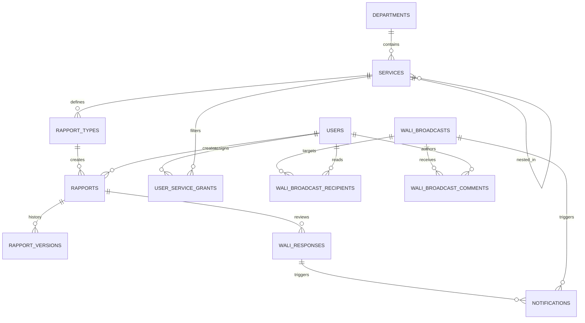

## Architecture & System Context: Wali Rapports

This document provides a comprehensive map of the **Wali Rapports** project architecture, detailing the codebase structure, directory patterns, database relations, API layout, and frontend flow. It serves as a canonical developer context for onboarding, system audits, and future extensions.

---

### 1. Codebase Directory Layout

```
app_wali_rapports/
├── spec/                    # System specifications folder
│   ├── modules/             # Specs for specific features (ORGANIZATION, RAPPORTS, etc.)
│   ├── CORE.md              # Shared standards & global rules
│   └── ARCHITECTURE_CONTEXT.md # This document
├── backend/                 # Backend project root (Node.js/Express)
│   ├── config/              # Sequelize database configurations
│   ├── src/
│   │   ├── db/              # Database connectivity, models, & migrations
│   │   │   ├── migrations/  # Sequelize migration history files
│   │   │   ├── models/      # Sequelize model definitions (User, Rapport, etc.)
│   │   │   └── seed-data/   # Initial reference and demo datasets
│   │   ├── middleware/      # JWT, roles, permissions, and request validation middlewares
│   │   ├── modules/         # Domain-focused services (organization, access, rapports)
│   │   ├── routes/          # Express routing (admin.js, office.js, wali.js, auth.js)
│   │   ├── services/        # Export engines, storage, table layout policy, rich HTML export
│   │   │   ├── tableLayoutPolicy.js   # Shared view/PDF/Word table rules
│   │   │   ├── rapportPdfService.js   # PDFKit PDF export
│   │   │   ├── rapportDocxService.js  # Word export
│   │   │   ├── richHtmlExport.js      # TipTap HTML → PDF/Word blocks
│   │   │   ├── waliResponseExport.js  # Fiche Wali response box (PDF/Word)
│   │   │   └── exportFonts.js         # Tahoma registration + pdfTextOpts
│   │   ├── utils/           # Shared helper functions (logger, file helpers)
│   │   └── validation/      # Server-side validation logic (Zod error mappings)
│   └── storage/             # Locally stored media uploads & exports (ignored by git)
└── frontend/                # Frontend project root (React/Vite/TypeScript)
    ├── src/
    │   ├── components/      # Reusable UI widgets, modals, forms & editors
    │   │   └── richText/    # TipTap rich text custom configuration files
    │   ├── hooks/           # Custom React hooks (useHubCounts, etc.)
    │   ├── pages/           # Role-based workspace pages (Admin, Office, Wali)
    │   ├── snackbar/        # Custom snackbar/notification context
    │   ├── theme/           # Color system token files (tokens.css)
    │   ├── types/           # TS interface and enum declarations
    │   ├── utils/           # Frontend business logic (formula engine, table layouts)
    │   └── validation/      # Client-side validation schemas (Zod forms)
```

---

### 2. Database Model Map

The database is built on **PostgreSQL** using **Sequelize ORM**. Relationships are established as follows:



#### Key Tables & Schemas

1. **User & Access Management**
   - `users`: Stores actor accounts. Includes `job_title`, `email`, `role` (`ADMIN` | `OFFICE_USER` | `WALI`), `access_role_template_id` (FK), `use_custom_permissions` (boolean), and `is_blocked`.
   - `access_role_templates` & `access_role_template_permissions`: Role profiles defining granular matrices (e.g. `none`, `view`, `manage` levels on key strings).
   - `user_permission_overrides`: Bypasses templates to assign custom keys directly to a specific user.
   - `user_service_grants`: Maps `OFFICE_USER` accounts to specific leaf services with an `access_level` (`view` | `manage`).

2. **Rapports & Lifecycles**
   - `departments` & `services`: The folder/hierarchy schema. Sub-services are modeled self-referentially inside `services` via `parent_service_id` and marked using `is_folder`.
   - `rapport_types`: Attached to services, specifying `content_kind` (`table_grid`, `document_compose`, `fiche_lecture`, `commune_list`), `versioning_mode` (`versioned`, `standalone`), and reference configurations (`schema_json`).
   - `rapports`: Main entity for document metadata (`title`, `reference_date`, `status`, `owner_office_user_id`). Status moves: `draft` -> `submitted` -> `under_review` -> `changes_requested` / `acknowledged` -> `archived`.
   - `rapport_versions`: Captures raw values inside `data_json` for snapshots. E.g., cell inputs, document blocks, and commune listings.
   - `wali_responses`: Wali comments on a submission version. Contains `decision` (`accepted`, `changes_requested`, `viewed`), `follow_up_status` (`none`, `pending`, `completed`), and `scope`/`scope_id` for targeted feedback.

3. **Shared Context & Extensions**
   - `uploaded_files`: Tracks attachments (`image`, `video`, `file`) uploaded via rapport fields or Wali broadcasts.
   - `rapport_calendar_events`: Events linked to reports displayed on the Wali's calendar interface.
   - `notifications`: Alerts on Wali/Chef feedback, discussion, broadcasts, pending inbox, calendar reminders — plus Web Push via `web_push_subscriptions` and prefs in `user_notification_preferences` (`DEVICE_NOTIFICATIONS.md`).
   - `wali_broadcasts`: System bulletins created by the Wali to share documents globally or with select recipients. Comments are tracked in `wali_broadcast_comments` and read markers in `wali_broadcast_recipients`.

---

### 3. API Routing & Middleware Structure

Routes are partitioned by role security barriers under the prefix `/api`:

- **Public / auth**: `POST /auth/login`, `POST /auth/refresh` (HttpOnly refresh cookie), `POST /auth/logout` — access JWT 15m HS256; refresh 7d — `spec/modules/AUTH.md`. Also notification prefs + Web Push subscribe under `/auth/me/notification-preferences` and `/auth/push/*`.
- **Admin Routing (`/admin/*`)**:
  - Bound to `requireRole('ADMIN')`.
  - Admin handles municipalities (`/admin/municipalities`), users (`/admin/users`), services (`/admin/services`), schemas (`/admin/table-schemas`), and departments.
  - Granular permissions checks are validated through the `requirePermission` middleware (e.g., `organization.users.manage`).
- **Office Routing (`/office/*`)**:
  - Accessible to `OFFICE_USER` or `ADMIN` actors.
  - Governs own service trees, draft saves, submissions to the Wali, templates creation, and notifications.
- **Wali Routing (`/wali/*`)**:
  - Restricted to `WALI` or `ADMIN` actors.
  - Controls inbox lists, details viewing, writing responses, checking calendar inputs, and launching file broadcasts.

#### Request Verification Pipeline
1. `requireAuth`: Extracts and validates the **access** JWT (`Authorization: Bearer`, `typ: "access"`).
2. `attachUser`: Attaches the user object from the DB database to `req.user`.
3. `checkBlocked`: Rejects credentials if `is_blocked === true`.
4. `requireRole` / `requirePermission`: Verifies access scopes before executing service controllers.

Refresh renewal uses the `wr_refresh` cookie on `/auth/refresh` only (hashed rows in `refresh_tokens`); see `spec/modules/AUTH.md`.

---

### 4. Frontend Application Structure

The UI is built with React, compiled via Vite, and styled with HSL tokens.

#### Design Tokens & Layouts
- **Theme Color tokens:** Declared under [tokens.css](file:///C:/Users/lemsa/Documents/wilaya/app_wali_rapports/frontend/src/theme/tokens.css) (uses a primary teal `#0d4f4f` and gold accent `#c9a227` to reflect governorate status).
- **RTL Support:** The application defaults to Arabic (RTL). Toggle switches to French (LTR). Document formatting toolbars (`.richTextToolbar`) use forced LTR direction to prevent left/right orientation buttons from swapping physically under RTL flex direction.
- **BackButtons:** Back buttons are consistently placed at the trailing end of actions tables.

#### Forms & Validation (Zod)
All forms are validated using Zod models located in [forms.ts](file:///C:/Users/lemsa/Documents/wilaya/app_wali_rapports/frontend/src/validation/schemas/forms.ts). The [useZodForm.ts](file:///C:/Users/lemsa/Documents/wilaya/app_wali_rapports/frontend/src/validation/useZodForm.ts) hook is used in components to handle validation states, displaying validation errors through `FieldErrorText` and global messages via `FormErrorBlock`.

#### Key Modules & Interactive Views
- **Table Grid View (`table_grid`)**: Rendered by [TableGridView.tsx](file:///C:/Users/lemsa/Documents/wilaya/app_wali_rapports/frontend/src/components/TableGridView.tsx). Wrapped in [TableScrollShell.tsx](file:///C:/Users/lemsa/Documents/wilaya/app_wali_rapports/frontend/src/components/TableScrollShell.tsx) for RTL + horizontal scroll on wide tables. Layout policy mirrored in [tableLayoutPolicy.ts](file:///C:/Users/lemsa/Documents/wilaya/app_wali_rapports/frontend/src/utils/tableLayoutPolicy.ts). Standardizes inputs, formats (percentages, currencies), cell highlights, and formulas computed using the custom engine [formulaEngine.ts](file:///C:/Users/lemsa/Documents/wilaya/app_wali_rapports/frontend/src/utils/formulaEngine.ts).
- **Wali inbox bell**: [WaliInboxBell.tsx](file:///C:/Users/lemsa/Documents/wilaya/app_wali_rapports/frontend/src/components/WaliInboxBell.tsx) shows a single `inbox_pending` counter in the app header; inbox rows styled via [waliInboxList.ts](file:///C:/Users/lemsa/Documents/wilaya/app_wali_rapports/frontend/src/utils/waliInboxList.ts).
- **Rich Document Editor (`document_compose` / `fiche_lecture`)**: Powered by [RichDocumentEditor.tsx](file:///C:/Users/lemsa/Documents/wilaya/app_wali_rapports/frontend/src/components/RichDocumentEditor.tsx) using TipTap. Allows template imports (replace or append) and media embeddings.
- **Wali Response Dialog**: Triggered by [WaliRespondModal.tsx](file:///C:/Users/lemsa/Documents/wilaya/app_wali_rapports/frontend/src/components/WaliRespondModal.tsx). Wali users type comments, set decisions, and toggle follow-up statuses (`pending`, `completed`).

---

### 5. Cross-Cutting Workflows

#### Document Template Resolution
When creating a new report within a service content hub:
1. System resolves report type specific document starter template.
2. If none, fetches the fallback document default template for the content kind.
3. If none, checks the service-wide default template.
4. If all fail, defaults to blank content (`schema_json.default_blocks`).

#### Report Version Submission
1. Office edits content in draft state -> `status = 'draft'`.
2. Office clicks "Submit" -> calls `/office/rapports/:id/submit`.
3. Backend freezes current data, increments version count, creates a snapshot row in `rapport_versions`, sets status to `submitted`, and triggers a Wali notification.
4. If Wali replies with `changes_requested`, status updates to `changes_requested`, notifying the author. The draft becomes editable again, repeating the cycle.

---

### 6. Demo & development data

| Command | Script | Purpose |
| ------- | ------ | ------- |
| `npm run db:seed-demo` | `backend/scripts/seed-demo-presentation.js` | Full presentation reset + seed (Hydraulique + Investissement) |
| `npm run db:seed-test` | `backend/scripts/seed-test-fixtures.js` | Minimal automated-test fixtures |
| `npm run db:seed-prod-bootstrap` | `backend/scripts/seed-prod-bootstrap.js` | **Once** with `CONFIRM_PROD_BOOTSTRAP=YES`: wipe domain + cabinet users + **root leaf** services; Excel in `storage/bootstrap/` — `spec/data/PROD_BOOTSTRAP.md` (temporary; do not re-run) |
| `npm run db:seed-prod-ensure` | `backend/scripts/seed-prod-ensure.js` | **Safe add**: `CONFIRM_PROD_ENSURE=YES` — create missing users/services/grants only; `credentials-added-*.xlsx` for new passwords |
| `npm run db:seed-demo-cabinet` | `backend/scripts/seed-demo-cabinet.js` | **Dev only**: fill existing cabinet services with presentation data (keeps users/services) |

**Demo seed (`db:seed-demo`)** — each run **wipes then reseeds** (safe while iterating):

Clears: departments/services, all rapports & related tables, grants, instructions, broadcasts, guide videos, refresh tokens, audit logs, permission overrides, **all non-admin users**, **all directions**, and soft-hide flags on dairas/communes.

Keeps: `ADMIN` account(s), Tlemcen dairas/communes (`db:seed-dev`), access role templates.

Then creates:

- Two departments/services: **Hydraulique**, **Investissement**
- All four `content_kind` examples: table grid, document compose, fiche lecture, commune list (table + complex)
- Liste **targets** mixing commune / daira / direction + `changed_entity_keys` across versions
- Rich fiches with `rich_html`, embedded tables; media/broadcast/guide files reuse `backend/storage/uploads/` when present
- Lifecycle samples: `draft`, `pending_chef`, `submitted`, `under_review`, `changes_requested` (`chef_gate=bypass`), `acknowledged`, plus soft-hidden rapport/type and org refs
- Chef responses, rapport discussion comments, Wali instructions, Wali broadcast (office + Chef), guide videos (all audiences including Admin-secret)
- Document templates, calendar events, notifications
- Fresh demo logins (password `TEST_USER_PASSWORD` or default **`Test1234!`**):
  - **`admin`** (from `db:seed-dev`) — compte admin
  - **`office1`** — Éditeur (manage both services)
  - **`office2`** — Lecture (view Hydraulique only)
  - **`chef1`** — رئيس الديوان
  - **`wali1`** — compte wali

Re-run anytime during demos: `cd backend && npm run db:seed-demo`.
