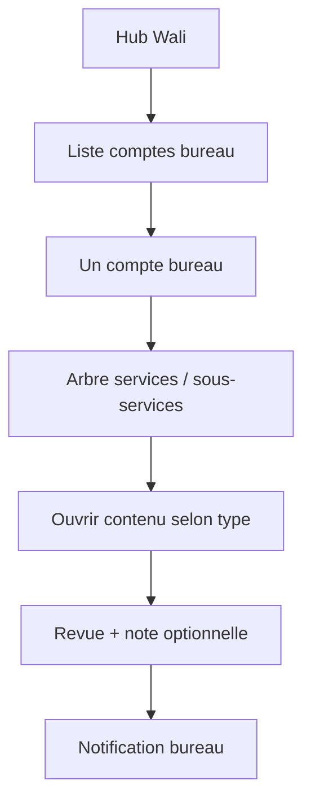

## Module: Rapport service types & Wali navigation

### Purpose & constraints

Define **how the Wali finds and reviews** office work, and **four content architectures** for services/sub-services.

**Presentation principle:** Wali users know Excel and Word. In-app views and exports must look **clear, printable, and familiar** — tables with borders, headers, bold titles, aligned numbers — so the Wali can decide quickly whether to **confirm**, **comment**, or **request changes**.

**Feedback loop:** When the Wali adds a note or command, the **office user must be notified** in-app (and spec allows future email). Office sees the Wali note on the rapport and can edit → save draft → resubmit (new version when versioned).

---

## Wali navigation model

1. **Wali hub** → **Comptes bureau** (one click per office user).
2. Select **office user** → see **services** assigned to that user (permission-scoped).
3. Service may be:
   - **Leaf** (single item — open directly), or
   - **Folder** with **sub-services** (e.g. Finance → Banque, Budget projets).
4. Opening a service shows content per **content kind** (types 1–4 below).
5. Wali may **view only** (no comment) or **respond** (note + confirm / demander modification) depending on submission state.

### Office navigation (mirror)

- Office hub → **Mes services** (same tree, filtered to own permissions).
- Draft work → **Enregistrer brouillon** → **Envoyer au wali** (creates submission; versioned types increment version).

---

## Four content kinds (`content_kind` on `rapport_types`)

| Kind | Code | Summary | Versioning | Wali interaction |
| ---- | ---- | ------- | ---------- | ---------------- |
| **1 — Table grid** | `table_grid` | One or more **tables** per service; typed columns; formulas; row visibility; cell highlights | Usually **versioned**; archive old versions for graphs | Per-table or whole-rapport submit; feedback optional or required |
| **2 — Document compose** | `document_compose` | **List of files**; each file = rich blocks (text, table, image) → PDF/Word | **Standalone** (new file per subject/date) | Wali reads export-like view; note on file |
| **3 — Fiche lecture** | `fiche_lecture` | Same as type 2 but **shared** by all office users; **new file every time** (dated) | **Standalone** (always new file + date) | Wali inbox grouped by date; optional note |
| **4 — Commune list** | `commune_list` | List of **communes** → per-commune table or form | Configurable: versioned whole état or standalone per period | Wali filters communes; sees highlighted rows |

Admin configures `content_kind` when creating a service / rapport type. A **service** may contain **multiple tables** (type 1) or **multiple document instances** (types 2–3).

---

## Type 1 — Table grid (like Operations in app_wilaya + Excel)

### Structure

- **Service** → one or more **`rapport_tables`** (logical sheets).
- Each table has a **column schema** (`rapport_table_schemas`) with typed columns (reuse Operations ideas):

| Column type | Use | Graphs |
| ----------- | --- | ------ |
| `text` | Labels, free text | — |
| `number` | Amounts, counts | Sum, trend, compare versions |
| `date` | Dates in cells | Timeline charts |
| `choice` | Enum / palette | Distribution |
| `commune_ref` | FK to `municipalities.code` | By commune |
| `formula` | Computed from other columns | Uses result as number |

### Calculated columns (Excel-like)

- Office defines formulas referencing **column keys** or **cell refs** (e.g. `(colA + colB) / colC` or row-aware `(A1 + B1) / C1`).
- **Display format** on number/formula columns: plain number, currency (DA), percentage, integer, decimal places.
- Server validates formula DAG (no cycles); recalc on save (phase 2 engine; spec first).

### Row visibility & emphasis (for Wali)

- Each row: `visibility_for_wali`: `visible` | `hidden_by_default`.
- Wali UI: default shows **visible** rows; button **Afficher lignes masquées** reveals hidden rows when needed (reports with 3 vs 30 lines).
- **Cell/row highlight**: office sets `highlight` (`none` | `important` | custom color) so Wali sees critical cases (e.g. 3 red rows).

### Versioning & archive

- **Versioned** rapport: each **Envoyer au wali** creates `rapport_versions` snapshot (full table data JSON).
- UI: button **Versions archivées** → list `v1, v2, …` with dates; read-only open.
- **Why archive:** graphs and year-to-date stats (e.g. total given to project Jan–Dec in one row) need historical snapshots.

### Graphs (deferred implementation, specified now)

- Built from **number/date** columns across **versions** or **rows**.
- X-axis: submission date **or** date column in table (admin/office chooses per chart config).

### Attachments at table end

- Optional **attachments block** after table: images/files (like Word annex) stored with version; included in PDF export.

---

## Type 2 — Document compose (list of files)

### Structure

- Service opens **list of documents** (rapports with `content_kind = document_compose`).
- **New document** → optional **template picker** (service templates or blank) → **rich HTML editor** (TipTap):
  - Bilingual `rich_html_ar` / `rich_html_fr` (headings, bold, colors, alignment, lists, tables in HTML).
  - **Embedded tables** (`embedded_tables[]`) with schema from table library or inline columns.
  - **Images** inline in HTML; legacy **blocks** (`heading`, `paragraph`, `media_row`) still rendered for old data.
- **Templates:** office defines reusable starters per service — see **`SCHEMA_CONFIGURATION.md`** (`rapport_document_templates`). Import in editor: **replace** or **append**.

### Output

- In-app editor with sticky formatting toolbar (physical left/center/right in RTL UI).
- Export **PDF** and **DOCX** — body matches editor (colors, alignment, tables, images); **no** rapport title, service header, or calendar section in the file.
- **Preview** before download; filename `{title} - {date}.pdf|.docx`.
- Tables with **>3 rows** in export use a portrait page break.

### Wali flow

- Opens document in reader view → optional **note** (confirm / demander modification).
- Note visible to authoring office user + **notification**.
- Wali export supports `showHidden` on table-grid rapports only; documents export editor content as-is.

---

## Type 3 — Fiche lecture

- Same **rich editor + templates + export** as type 2 (blocks legacy path still supported).
- **One `fiche_lecture` rapport type on every leaf service** (slug `fiche_lecture`).
- **Shared** = all office users with access to that service see the **same chronological list**; each new fiche is a **new dated file** (not owned by one user — `owner_office_user_id` is null).
- Wali: list grouped by date per service; read; optional feedback.

---

## Type 4 — Commune list

### Structure

- Service shows **list of communes** (`municipalities` reference).
- Click commune → **per-commune panel**: table (type-1 mini) or **custom inputs** (admin-defined schema).
- Admin can switch **versioning_mode**:
  - **Versioned**: whole état (all communes) one rapport, new version on send.
  - **Standalone**: new rapport per period/subject.

### Draft / send

- Office saves **draft** per commune or whole grid; **send to wali** locks version and notifies.

---

## Sub-services (folders)

- Table **`sub_services`**: `parent_service_id`, `slug`, names, `sort_order`, optional `content_kind` override.
- Example Finance service:
  - `finance` (folder)
    - `finance-banque` (leaf, table_grid)
    - `finance-budget-projets` (leaf, table_grid)
- Leaf nodes link to `rapport_types` / default schemas.

---

## Wali feedback & notifications

### `wali_responses` (extended)

- `decision`: `accepted` | `changes_requested` | `viewed` (no comment — wali saw update only)
- `body_text`: note / command (required when `changes_requested`)
- `scope`: `whole_rapport` | `table` | `document` | `commune` (optional `scope_id`)

### `notifications`

- `user_id` (office recipient), `rapport_id`, `wali_response_id`, `read_at`, `created_at`
- Office hub badge + list **Notifications du wali**
- Mark read when user opens rapport

### Optional comment

- Wali may **only view** (status → `under_review` / `acknowledged` without text) when no action needed — office not blocked.

---

## Schema templates library

- **`rapport_table_schemas`**: reusable column definitions — **admin creates/edits via `/admin/schemas`** (not hardcoded per domain).
- Each **`rapport_type`** with `content_kind = table_grid` links to a schema via `schema_json.table_schema_slug`.
- Type-2 document composer: **Import schema** into embedded tables; **document templates** for full HTML starters — `SCHEMA_CONFIGURATION.md`.
- **Demo seeds** (Finance consommation crédits, Hydraulique barrages) are **sample data only** — add real services/schemas through admin UI.

See **`SCHEMA_CONFIGURATION.md`** for admin API and workflow.

---

## API endpoints (planned — extend phase 2)

### Wali navigation

| Method | Path | Description |
| ------ | ---- | ----------- |
| `GET` | `/wali/office-users` | List office users with pending/submitted counts |
| `GET` | `/wali/office-users/:userId/services` | Service tree for that user |
| `GET` | `/wali/services/:serviceId/content` | Open service content (tables/docs/list) |

### Office

| Method | Path | Description |
| ------ | ---- | ----------- |
| `GET` | `/office/services/tree` | Own service/sub-service tree |
| `GET` | `/office/rapports/:id/versions` | Archive list |
| `GET` | `/office/rapports/:id/versions/:versionId` | Read-only old version |
| `GET` | `/office/notifications` | Wali notes unread |
| `PATCH` | `/office/notifications/:id/read` | Mark read |

### Table grid (type 1)

| Method | Path | Description |
| ------ | ---- | ----------- |
| `GET` | `/office/rapports/:id/tables/:tableKey` | Table data + schema |
| `PATCH` | `/office/rapports/:id/tables/:tableKey` | Save draft rows + formulas |
| `POST` | `/office/rapports/:id/tables/:tableKey/submit` | Submit single table to wali (optional partial submit) |

### Document templates & create (office)

| Method | Path | Description |
| ------ | ---- | ----------- |
| `GET` | `/office/services/:serviceId/document-templates/for-create` | Templates for new document/fiche |
| `POST` | `/office/services/:serviceId/documents` | Create document; body `template_id`, `skip_default` |
| `POST` | `/office/rapports/:id/document/apply-template` | Import template (`replace` \| `append`) |

See full CRUD in **`SCHEMA_CONFIGURATION.md`**.

### Export (office & wali)

| Method | Path | Description |
| ------ | ---- | ----------- |
| `GET` | `/office/rapports/:id/export.pdf` | PDF (`?locale=ar\|fr`) |
| `GET` | `/office/rapports/:id/export.docx` | Word |
| `GET` | `/wali/rapports/:id/export.pdf` | PDF + `?showHidden=0\|1` for table grids |
| `GET` | `/wali/rapports/:id/export.docx` | Word |

Details: **`spec/CORE.md`** § Rapport export.

---

## UI/UX — Wali presentation rules

- **Tables:** bordered grid, sticky header, RTL numbers aligned; hidden rows collapsed with expand control.
- **Highlights:** warm/yellow/red badges on rows/cells — legend at top.
- **Documents:** A4-width editor; export preview modal; centered titles inside content; bold section headings; sticky toolbar.
- **Version button:** prominent **Versions archivées** on versioned types.
- **Feedback panel:** fixed side or bottom — Wali types note; buttons **Confirmer** / **Demander modification** / **Lu sans commentaire**.
- **Office:** notification bell; opening rapport shows Wali note thread per version.

---

## Audit events (additional)

| Action type | When |
| ----------- | ---- |
| `RAPPORT_TABLE_SAVE` | Draft table save |
| `RAPPORT_TABLE_SUBMIT` | Table submitted to wali |
| `RAPPORT_VERSION_OPEN` | User opens archived version |
| `RAPPORT_FORMULA_RECALC` | Formula engine run |
| `NOTIFICATION_READ` | Office marks notification read |

---

## Implementation phases

| Phase | Scope |
| ----- | ----- |
| **2a** | DB: sub_services, content_kind, schemas, notifications; Wali office-user → service tree API |
| **2b** | Type 1 table UI + column types + row visibility + highlights |
| **2c** | Formula engine + formats |
| **2d** | Type 2/3 rich editor + document templates + PDF/DOCX export + preview **(implemented)** |
| **2e** | Type 4 commune list + graphs from version archive |

---

## Migration notes

- Migration `20260608_000004_service_types_navigation.js` adds: `sub_services`, extends `rapport_types.content_kind`, `rapport_table_schemas`, `notifications`.
- Migration `20260617_000014_document_templates.js` adds: `rapport_document_templates`.
