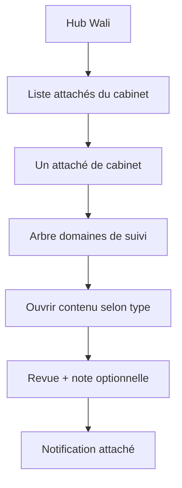

## Module: Rapport service types & Wali navigation

### Purpose & constraints

Define **how the Wali finds and reviews** office work, and **four content architectures** for services/sub-services.

**Presentation principle:** Wali users know Excel and Word. In-app views and exports must look **clear, printable, and familiar** — tables with borders, headers, bold titles, aligned numbers — so the Wali can decide quickly whether to **confirm**, **comment**, or **request changes**.

**Feedback loop:** When the Wali adds a note or command, the **office user must be notified** in-app (and spec allows future email). Office sees the Wali note on the rapport and can edit → save draft → resubmit (new version when versioned).

---

## Wali navigation model

1. **Wali hub** → **ملحقو الديوان / Attachés du cabinet** (one click per office user).
2. Select **attaché** → see **domaines de suivi** (`services`) assigned to that user (permission-scoped).
3. Service may be:
   - **Leaf** (single item — open directly), or
   - **Folder** with **sub-services** (e.g. Finance → Banque, Budget projets).
4. Opening a service shows content per **content kind** (types 1–4 below).
5. Wali may **view only** (no comment) or **respond** (note + confirm / demander modification) depending on submission state.

### Office navigation (mirror)

- Office hub → **مجالات المتابعة / Domaines de suivi** (same tree, filtered to own permissions).
- Draft work → **Enregistrer brouillon** (first save creates `draft`) → **Envoyer au wali** (creates submission; versioned types increment version).
- **Office service badges** (`action_count` / `services_action_count`): count `changes_requested` rapports in services the user can access (any owner). Soft-hidden rapport types that still have a pending action remain visible on the service hub so the badge is clickable.

---

## Four content kinds (`content_kind` on `rapport_types`)

| Kind                     | Code               | Summary                                                                                      | Versioning                                                  | Wali interaction                                                 |
| ------------------------ | ------------------ | -------------------------------------------------------------------------------------------- | ----------------------------------------------------------- | ---------------------------------------------------------------- |
| **1 — Table grid**       | `table_grid`       | One or more **tables** per service; typed columns; formulas; row visibility; cell highlights | Usually **versioned**; archive old versions for graphs      | Per-table or whole-rapport submit; feedback optional or required |
| **2 — Document compose** | `document_compose` | **List of files**; each file = rich blocks (text, table, image) → PDF/Word                   | **Standalone** (new file per subject/date)                  | Wali reads export-like view; note on file                        |
| **3 — Fiche lecture**    | `fiche_lecture`    | Same as type 2 but **shared** by all office users; **new file every time** (dated)           | **Standalone** (always new file + date)                     | Wali inbox grouped by date; optional note                        |
| **4 — قائمة / Liste**    | `commune_list`     | Configurable targets: **communes** and/or **dairas** and/or **directions** → per-entity table or form | Configurable: versioned whole état or standalone per period | Filters entities; sees highlighted rows; `entity_target_kinds` on type |

Admin configures `content_kind` when creating a service / rapport type. A **service** may contain **multiple tables** (type 1) or **multiple document instances** (types 2–3).

**UI labels (AR / FR, never raw enums):** جدول / Tableau · ملف مركّب / Document · مذكرة استخلاصية / Fiche lecture · **قائمة / Liste**.

---

## Type 1 — Table grid (like Operations in app_wilaya + Excel)

### Structure

- **Service** → one or more **`rapport_tables`** (logical sheets).
- Each table has a **column schema** (`rapport_table_schemas`) with typed columns (reuse Operations ideas):

| Column type   | Use                         | Graphs                       |
| ------------- | --------------------------- | ---------------------------- |
| `text`        | Labels, free text           | —                            |
| `number`      | Amounts, counts             | Sum, trend, compare versions |
| `date`        | Dates in cells              | Timeline charts              |
| `choice`      | Enum / palette              | Distribution                 |
| `commune_ref` | FK to `municipalities.code` | By commune                   |
| `formula`     | Computed from other columns | Uses result as number        |

### Calculated columns (Excel-like)

- Office defines formulas referencing **column keys** or **cell refs** (e.g. `(colA + colB) / colC` or row-aware `(A1 + B1) / C1`).
- **Display format** on number/formula columns: plain number, currency (DA), percentage, integer, decimal places.
- Server validates formula DAG (no cycles); recalc on save.
- **Formula evaluation is math-only** (recursive parser; no `Function`/`eval`/`require`). Allowed: numbers, `+ - * / %`, parentheses, comparisons, ternary, `Math.min` / `Math.max`, and helpers `IF`/`SUM`/`AVG`/`MIN`/`MAX`/`PCT`. Other identifiers are rejected.

### Row visibility & emphasis (for Wali)

- Each row: `visibility_for_wali`: `visible` | `hidden_by_default`.
- Wali UI: default shows **visible** rows; button **Afficher lignes masquées** reveals hidden rows when needed (reports with 3 vs 30 lines).
- **Cell/row highlight**: office sets `highlight` (`none` | `important` | custom color) so Wali sees critical cases (e.g. 3 red rows).
- **Row finished** (`_row_finished`): office marks a row as done; filter **Actives / Terminées / Toutes** in the table toolbar.
- **Line numbers (`#`)**: sequential **1…N** in the **current visible list** (after filters), not raw array index. Toolbar shows total count (e.g. « 25 lignes »).
- **Drag reorder**: editable tables show a drag handle (⋮⋮). Reorder updates `rows[]` array order on save. Scope:
  - **`table`** (default): any row can move anywhere in the table (table grid, single-commune editor, embedded tables).
  - **`commune`** (commune bulk entry): reorder **within the same `municipality_code` only** — a row in Tlemcen cannot move into another commune’s block.
- **Hide rapport / type** (office): soft-hide individual rapports (`rapports.hidden_at`) or rapport types (`rapport_types.hidden_at`) from service hubs; **fiche_lecture** type cannot be hidden as a type. Restore from « hidden » filter. Confirm dialog before hide.
  - **Office hub:** hidden types excluded by default; exception — a soft-hidden type that still has `changes_requested` rapports stays visible so the action badge remains clickable.
  - **Wali / Chef hubs:** soft-hidden types are **never** shown (no office action-badge exception). Soft-hidden rapports are excluded from lists and cannot be opened by direct URL (`404`).

### Versioning & archive

- **Versioned** rapport: each **Envoyer au wali** creates `rapport_versions` snapshot (full table data JSON).
- UI: button **Versions archivées** → list `v1, v2, …` with dates; read-only open.
- **Why archive:** graphs and year-to-date stats (e.g. total given to project Jan–Dec in one row) need historical snapshots.
- **Read-only version open** (office / Wali / Chef): resolve snapshot content by `content_kind`:
  - `table_grid` → `schema_snapshot` + `tables[0]` via `TableWorkspace`
  - `document_compose` / `fiche_lecture` → `RichDocumentView` from snapshot HTML/blocks/embedded tables
  - `commune_list` (table or complex) → resolve **`data_json.entities`** with prefixed keys (`commune:…` / `daira:…` / `direction:…`), dual-read legacy **`data_json.communes`** (bare codes). Changed badges dual-read `changed_entity_keys` and legacy `changed_commune_codes`.

### Graphs (deferred implementation, specified now)

- Built from **number/date** columns across **versions** or **rows**.
- X-axis: submission date **or** date column in table (admin/office chooses per chart config).

### Attachments at table end

- Optional **attachments block** after table: images/files (like Word annex) stored with version; included in PDF export.

### Table layout (view + export)

- **In-app:** tables scroll horizontally inside `TableScrollShell` when content-aware min widths exceed the view budget (RTL shell for Arabic); see `spec/CORE.md` § Table layout policy.
- **Export:** same column-weight and landscape rules as `spec/CORE.md` § Table layout policy — PDF RTL column order for Arabic, Word `visuallyRightToLeft`, no automatic page break by row count alone.

---

## Type 2 — Document compose (list of files)

### Structure

- Service opens **list of documents** (rapports with `content_kind = document_compose`).
- **New document** → optional **template picker** (service templates or blank) → **rich HTML editor** (TipTap):
  - Bilingual `rich_html_ar` / `rich_html_fr` (headings, bold, colors, alignment, lists, tables in HTML).
  - **Embedded tables** (`embedded_tables[]`) with schema from table library or inline columns.
    - Insert options: empty from existing schema, create new schema (live column preview like admin/office), or import from another rapport.
    - Empty-from-schema and create/import all open the **fill modal** before the table is inserted into the document.
    - Fill modal is rapport-scoped: `#` column, add/remove/reorder rows allowed; **no** finish / Wali-visible meta columns and **no** active/finished/all row filters.
    - Empty-from-schema insert tab shows a live preview of the selected schema (columns list + empty grid), same pattern as import-from-rapport.
    - Inline document view (editor / preview / reader) and PDF/DOCX export show the `#` row column on embedded tables (no Wali/finish meta).
  - **Images** inline in HTML; legacy **blocks** (`heading`, `paragraph`, `media_row`) still rendered for old data.
- **Templates:** office defines reusable starters per service — see **`SCHEMA_CONFIGURATION.md`** (`rapport_document_templates`). Import in editor: **replace** or **append**. Office UI for document templates is gated by frontend `ENABLE_DOCUMENT_TEMPLATES` (default off); when off, service-config step-3 / templates help and tab are hidden as well; API remains available.

### Output

- In-app editor with sticky formatting toolbar (physical left/center/right in RTL UI).
- Export **PDF** and **DOCX** — body matches editor (colors, alignment, tables, images); **no** rapport title, service header, or calendar section in the file.
- **Preview** before download; filename `{title} - {date}.pdf|.docx`.
- Embedded/export tables follow **`spec/CORE.md` § Table layout policy** (no row-count page break; landscape only when width requires it).
- **`fiche_lecture` export:** after the document body, append the **Wali response block** (decision + optional note + 2 blank ruled lines) when exported from Wali or office preview.

### Wali flow

- Opens document in reader view → optional **note** (confirm / demander modification).
- Note visible to authoring office user + **notification**.
- Wali export supports `showHidden` on table-grid rapports only; documents export editor content as-is.

---

## Type 3 — Fiche lecture

- Same **rich editor + templates + export** as type 2 (blocks legacy path still supported).
- **One `fiche_lecture` rapport type on every leaf service** (slug `fiche_lecture`).
- **Shared** = all office users with access to that service see the **same chronological list**; each new fiche is a **new dated file** (not owned by one user — `owner_office_user_id` is null).
- Wali: list grouped by date per service; read; optional feedback.

---

## Type 4 — قائمة / Liste (`commune_list`)

- Collection of data for selected **entity kinds** in the Wilaya (not communes-only).
- **`entity_target_kinds`** on `rapport_types`: JSON array subset of `commune` | `daira` | `direction` (at least one). Default `["commune"]` for backward compatibility.
- **Per-rapport membership** (`data_json.included_entity_keys`): optional non-empty array of prefixed keys (`daira:1301`, …). Absent / null = **all** entities of the type’s kinds. Office can narrow or expand the set while the rapport is `draft` / `changes_requested` (hub **Choisir la liste**). Removing a key hides it from the hub without deleting stored entity data (re-adding restores content). After finish (soft-hide), the next draft is created only on **first Enregistrer** and **inherits** the previous finished rapport’s `included_entity_keys`.
- **Office view**: Hub grouped by kind (only included entities); progress counter sums filled across all kinds with kind-aware unit wording (بلدية / دائرة / مديرية / عنصر). Click one entity to edit **or** **Bulk Entry** (table mode) across selected kinds.
- **Modes** (`commune_content_kind` on `rapport_types`):
  - **`complex`**: Rich text document per entity (like type 2). **No linked table schema** required at create time.
  - **`table`**: Grid rows per entity. **Requires linked table schema**. Same row tools as type 1.
- **Create rapport type** (admin + office): multi-select targets; schema selector shown only for `table_grid` and `commune_list` + `table`.
- **Storage keys** in `data_json.entities` (or migrated `communes`): prefixed `commune:1301`, `daira:1304`, `direction:DIR01`.
- **Bulk entry (table mode)**:
  - First column = entity display name (read-only) + kind.
  - **Drag reorder** uses **`commune` scope** generalized to **per-entity** blocks. Export `#` remains global sequential.
- **Versioning**: On submit, compare each entity → `changed_entity_keys` (legacy `changed_commune_codes` dual-write/dual-read). Snapshots in `entity_versions` / legacy `commune_versions`.
- **Read-only archive view**: same entity dual-read as above — never rely on `communes` alone when `entities` is present.
- **Wali / Chef view**: Hub with badges **Filled** / **Changed**; filter Modifiées. **Versions archivées** modal.
- Reference data: communes → daira; dairas and directions (UI **Directions** / المديريات) managed in admin — see `ORGANIZATION.md`.
- **Soft-hidden refs** (`hidden_at` on daira / commune / direction): **new** hubs, bulk editors, and `selection_catalog` / “all entities” membership use **active** rows only. Keys already in `included_entity_keys` or stored in `data_json.entities` / legacy `communes` still resolve names and remain editable/viewable on that rapport (and in archives).

### Chef Cabinet gate (cross-cutting)

- First office **Envoyer** → status `pending_chef` when `chef_gate = required`.
- Chef accept → `submitted` (Wali inbox). Chef demand/reject → `changes_requested`.
- Wali demand changes → `chef_gate = bypass`; next office submit skips Chef (Chef notified only).
- Remarks: show Chef responses then Wali responses on the rapport — `CHEF_CABINET.md`.

---

## Sub-services (folders)

- Table **`sub_services`**: `parent_service_id`, `slug`, names, `sort_order`, optional `content_kind` override.
- Example Finance service:
  - `finance` (folder)
    - `finance-banque` (leaf, table_grid)
    - `finance-budget-projets` (leaf, table_grid)
- Leaf nodes link to `rapport_types` / default schemas.

---

## Wali feedback & notifications

### `wali_responses` (extended)

- `decision`: `accepted` | `changes_requested` | `viewed` (no comment — wali saw update only)
- `follow_up_status`: `none` | `pending` | `completed` (only applicable when `decision` is `accepted`)
- `rapport_version_id`: FK to the specific snapshot version reviewed
- `body_text`: note / command (required when `changes_requested`)
- `scope`: `whole_rapport` | `table` | `document` | `commune` (optional `scope_id`)

### `notifications`

- `user_id` (office recipient), `rapport_id` (nullable FK), `broadcast_id` (nullable FK to `wali_broadcasts`), `wali_response_id` (nullable FK), `message_key` (e.g. `waliFeedback` or `waliBroadcast`), `read_at`, `created_at`
- Office hub badge + list **Notifications du wali** (`unread_notifications`): feedback / chef replies / discussion only — **excludes** `waliInstruction`, `waliBroadcast`, `waliBroadcastReminder` (those use `unread_instructions` / `unread_shared_files`). List API applies the same exclusion.
- Mark read when user opens rapport; generic notification mark-read also clears linked broadcast/instruction recipient rows.
- Web Push, preference filtering, Chef/Wali pending keys, calendar reminders: **`DEVICE_NOTIFICATIONS.md`**.

### Optional comment

- Wali may **only view** (status → `under_review` / `acknowledged` without text) when no action needed — office not blocked.

---

## Schema templates library

- **`rapport_table_schemas`**: reusable column definitions — **admin creates/edits via `/admin/schemas`** (not hardcoded per domain).
- Each **`rapport_type`** with `content_kind = table_grid` links to a schema via `schema_json.table_schema_slug`.
- Type-2 document composer: insert embedded tables (empty schema → fill, create with live preview, import from rapport); **document templates** for full HTML starters — `SCHEMA_CONFIGURATION.md`.
- **Demo seeds:** `npm run db:seed-demo` (`backend/scripts/seed-demo-presentation.js`) resets domain rapports/services and loads a **presentation dataset** (Hydraulique + Investissement) covering all four content kinds, Chef gate / bypass, discussions, instructions, broadcasts (office + Chef), guide videos, soft-hide samples, and commune/daira/direction liste targets. Logins: `admin`, `office1` (manage), `office2` (view), `chef1`, `wali1` — password from `TEST_USER_PASSWORD` or default `Test1234!`. Full inventory: `spec/ARCHITECTURE_CONTEXT.md` § Demo data. Sample data only — add real services/schemas through admin UI.

See **`SCHEMA_CONFIGURATION.md`** for admin API and workflow.

---

## API endpoints (planned — extend phase 2)

### Wali navigation

| Method | Path                                  | Description                                     |
| ------ | ------------------------------------- | ----------------------------------------------- |
| `GET`  | `/wali/office-users`                  | List office users with pending/submitted counts |
| `GET`  | `/wali/office-users/:userId/services` | Service tree for that user                      |
| `GET`  | `/wali/services/:serviceId/content`   | Open service content (tables/docs/list)         |

### Office

| Method  | Path                                       | Description                  |
| ------- | ------------------------------------------ | ---------------------------- |
| `GET`   | `/office/services/tree`                    | Own service/sub-service tree |
| `GET`   | `/office/rapports/:id/versions`            | Archive list                 |
| `GET`   | `/office/rapports/:id/versions/:versionId` | Read-only old version        |
| `GET`   | `/office/notifications`                    | Wali notes unread            |
| `PATCH` | `/office/notifications/:id/read`           | Mark read                    |

### Table grid (type 1)

| Method  | Path                                           | Description                                           |
| ------- | ---------------------------------------------- | ----------------------------------------------------- |
| `GET`   | `/office/rapports/:id/tables/:tableKey`        | Table data + schema                                   |
| `PATCH` | `/office/rapports/:id/tables/:tableKey`        | Save draft rows + formulas                            |
| `POST`  | `/office/rapports/:id/tables/:tableKey/submit` | Submit single table to wali (optional partial submit) |

### Document templates & create (office)

| Method | Path                                                        | Description                                         |
| ------ | ----------------------------------------------------------- | --------------------------------------------------- |
| `GET`  | `/office/services/:serviceId/document-templates/for-create` | Templates for new document/fiche                    |
| `POST` | `/office/services/:serviceId/documents`                     | Create document; body `template_id`, `skip_default` |
| `POST` | `/office/rapports/:id/document/apply-template`              | Import template (`replace` \| `append`)             |

See full CRUD in **`SCHEMA_CONFIGURATION.md`**.

### Export (office & wali)

| Method | Path                               | Description                              |
| ------ | ---------------------------------- | ---------------------------------------- |
| `GET`  | `/office/rapports/:id/export.xlsx` | Excel (table grid; Wali/meta columns, cell colors) |
| `GET`  | `/office/rapports/:id/export.pdf`  | PDF (`?locale=ar\|fr`)                   |
| `GET`  | `/office/rapports/:id/export.docx` | Word                                     |
| `GET`  | `/wali/rapports/:id/export.xlsx`   | Excel (same as office for table types)   |
| `GET`  | `/wali/rapports/:id/export.pdf`    | PDF + `?showHidden=0\|1` for table grids |
| `GET`  | `/wali/rapports/:id/export.docx`   | Word                                     |

Details: **`spec/CORE.md`** § Rapport export.

---

## UI/UX — Wali presentation rules

- **Inbox list** (`/wali/rapports` and `/chef/rapports`): columns for title, **service**, **rapport type**, status, actions; optional **title search**.
- **Status colors:** row background tints by status (`submitted`, `under_review`, `acknowledged`, `changes_requested`); legend bar at top of inbox.
- **New submissions:** `is_inbox_new` shows **« جديد »** badge on title; row classes `waliInboxRowNew` / `waliInboxRowPending`.
- **Wali decision on row:** when a response exists, show compact decision badge under status (not a duplicate full note).
- **Top bar counter:** **one** pending inbox count on `WaliInboxBell` (`inbox_pending` from hub counts API) — do not duplicate inbox badges on service hub tiles in Wali navigation.
- **Tables:** bordered grid, sticky header, RTL column order in Arabic; horizontal scroll when content-aware min widths exceed the shell; hidden rows collapsed with expand control.
- **Highlights:** warm/yellow/red badges on rows/cells — legend at top.
- **Documents:** A4-width editor; export preview modal; centered titles inside content; bold section headings; sticky toolbar.
- **Version button:** prominent **Versions archivées** on versioned types.
- **Feedback panel:** fixed side or bottom — Wali types note; buttons **Confirmer** / **Demander modification** / **Lu sans commentaire**.
- **Office:** notification bell; opening rapport shows Wali note thread **per version** only (Chef + Wali). Live editors / Wali–Chef inbox view use the active reviewed version (`current_version_id`, or latest submitted when a `changes_requested` draft was forked). Archive `/versions/:id` shows only notes for that opened version — never the full history.

---

## Audit events (additional)

| Action type              | When                           |
| ------------------------ | ------------------------------ |
| `RAPPORT_TABLE_SAVE`     | Draft table save               |
| `RAPPORT_TABLE_SUBMIT`   | Table submitted to wali        |
| `RAPPORT_VERSION_OPEN`   | User opens archived version    |
| `RAPPORT_FORMULA_RECALC` | Formula engine run             |
| `NOTIFICATION_READ`      | Office marks notification read |

---

## Implementation phases

| Phase  | Scope                                                                                       |
| ------ | ------------------------------------------------------------------------------------------- |
| **2a** | DB: sub_services, content_kind, schemas, notifications; Wali office-user → service tree API |
| **2b** | Type 1 table UI + column types + row visibility + highlights                                |
| **2c** | Formula engine + formats                                                                    |
| **2d** | Type 2/3 rich editor + document templates + PDF/DOCX export + preview **(implemented)**     |
| **2e** | Type 4 commune list + graphs from version archive                                           |

---

## Migration notes

- Migration `20260608_000004_service_types_navigation.js` adds: `sub_services`, extends `rapport_types.content_kind`, `rapport_table_schemas`, `notifications`.
- Migration `20260617_000014_document_templates.js` adds: `rapport_document_templates`.
